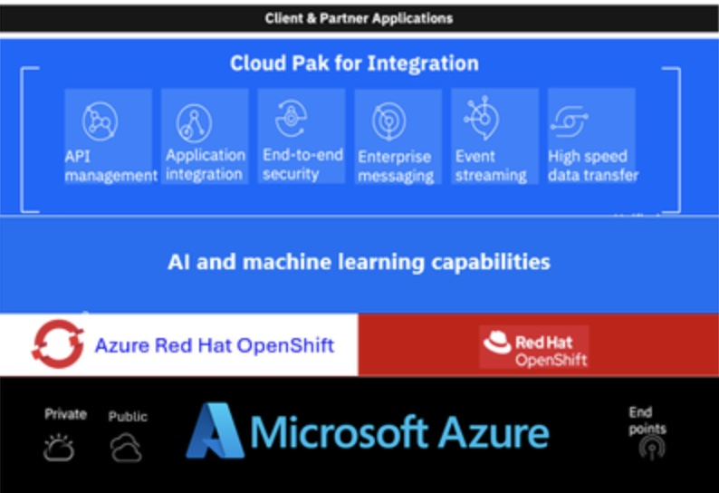
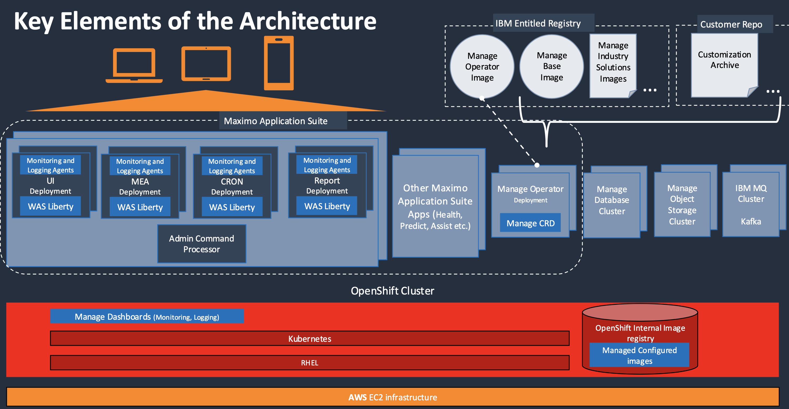

This is a repo of Public links for General OpenShift Content for the DST team                      
by Andrew Grimes                                                       
Date: 06/09/25                                                     

Red Hat OCP Sales Plays: (Internal) 2025 is still under construction                                     
https://content.redhat.com/us/en/sales-enablement/sales-plays-overview.html

Red Hat SSP Resource Page: (Internal)                                                                        
https://source.redhat.com/groups/public/na_gtm_tech_team/ssp_resources

Commercial Rediness Handbook                                                     
https://docs.google.com/presentation/d/1DT6kPNjhecawJgBTy8pZ8tRoi45ALUk4xYY_y3n7PNo/edit

Red Hat Subscription process for self managed (external)              
https://www.redhat.com/en/resources/self-managed-openshift-subscription-guide?extIdCarryOver=true&sc_cid=RHCTL0250000436420

Red Hat Appications Subscription Guide (external)                    
https://www.redhat.com/en/resources/application-services-subscription-guide-detail

OCP App Platform 101 Customer Facing
https://content.redhat.com/us/en/assets/display.html?id=e5c4e357-a4f8-44d7-ba51-2fbb0e21cb76

OCP App Platform 301 Customer Facing Provisional   
https://docs.google.com/presentation/d/1mFMb2iRW1ivK2uozpMnJPkSqeahcNhcIIoUXvWZ0TVc/edit#slide=id.g2afd75cb101_0_7186

OCP Developer Hub App Mod Provisional 
https://docs.google.com/presentation/d/1Dr2H0O72m_JxUwoyvtHLaXjUjJ84_UGdgeJiO--00uw/edit#slide=id.g201d508a934_0_160

Interactive Demo's for customers (Public) 
https://www.redhat.com/en/interactive-experiences

Virtualizaiton                                         
Sales Customer Virtualizaiton Deck 101                   
https://content.redhat.com/us/en/assets/display.html?id=3b4be039-193b-43cb-b0ab-24976608421b

Technical Virtualization Deck 301                                                         
https://content.redhat.com/us/en/assets/display.html?id=0a9e3bc2-276d-4ab0-971a-be4ad0c3a546

References 060925 (internal) 
https://docs.google.com/presentation/d/1AaoN4gNG05yoGv-FHF_lFEnXpDQEA6iEHwmHZmMEzQo/edit?slide=id.g35fa5da1d0d_2_7#slide=id.g35fa5da1d0d_2_7

Workshops                  
https://www.redhat.com/en/events/na-red-hat-openshift-virtualization

Hardware Catalog (external)
https://catalog.redhat.com/search?searchType=hardware&certified_RedHat_Platforms=Red%20Hat%20OpenShift%20Container%20Platform&p=1

OVE                                                 
https://docs.google.com/presentation/d/1bq_Timl1H9KL79g3wcgLhV10tzGRKrdZfLw-GadVako/edit#slide=id.g3251b95ef10_10_0

VMware Wave Qualification
https://docs.google.com/presentation/d/1CG1ntA2HyTXWCxTLntm0M1FdyMPu45qvd_L_pAsSTW0/edit#slide=id.g1f549af855e_0_247

Virt Reference Architecture                                               
https://access.redhat.com/articles/7067871
https://access.redhat.com/sites/default/files/attachments/openshift_virtualization_reference_implementation_guide_v1.0.2_0.pdf

Virt sizing Guide
https://access.redhat.com/articles/7107457

OpenShift Virt Internal Resources                
https://catalog.redhat.com/platform/red-hat-openshift/virtualization

OpenShift Virt Partner Assessment Dashboard.                       
OpenShift Virt partner Assessment Dashboard. https://lookerstudio.google.com/u/0/reporting/f87e99f4-87de-4cd6-ad38-2fce9636f29e/page/p_xr0ju4ihjd

Supported Guest OS            
https://access.redhat.com/articles/4234591

Bare Metal Discount Process                       
https://docs.google.com/presentation/d/1nDrBRZ-GvJwbpLkmlguqx9CxRRi6iWbNDGkOxCPgaCA/edit#slide=id.g2d86095e9e2_0_5416

Vritualization Sizing Guide                
https://access.redhat.com/articles/7107457

RH1 Pricing Presentation 
https://docs.google.com/presentation/d/1tdtqXpLFHQWc2lWQ_TP1-NlYxakKA4g7g0exTwMoWQ8/edit#slide=id.g2d600506f38_2_387

OVE Pricing FAQ
https://docs.google.com/document/d/1VPg2TE-oC1lcExbuL9YCesHfLhTKzCZA0Xh2m9G3o78/edit?tab=t.0#heading=h.66y4kqbj468a

Virt Storage FAQ ODF
https://docs.google.com/document/d/1XIOInsGg-0NorNZUBw_Gg3c4wVprdJLDt24iQLQxja0/edit?tab=t.0#heading=h.69cp25f6yx73

Virt References
Hybrid VM and App             
https://www.redhat.com/rhdc/managed-files/vi-reist-customer-case-study-1609321-202501-en.pdf

TCO Self Service Deck
https://docs.google.com/presentation/d/1XFjLVHJd53bwVKqC98wXPNbaKSR0243MD6PuK31FJ3E/edit?slide=id.g31a98622a8a_0_2098#slide=id.g31a98622a8a_0_2098

TCO Self Service Calculator
https://redhatdg.co1.qualtrics.com/jfe/form/SV_82F75bRBCaVyakS

IBM Software on ARO: 

    
  <em> 
  </em>

Workload Sales Play                                       
RH1 Session for Workloads OPP+ and Clouds 
https://docs.google.com/presentation/d/1n4ds_0CtTrhz2p0jUsKM5DXsPZEO1vrR7HVUk8eI8IE/edit#slide=id.g2851766554b_0_121

Maximo on ARO (Azure Deck)                                  
https://docs.google.com/presentation/d/1Q_P6KkIRi4XGCCgjDjBRmVVKbDmRqRQ3/edit?usp=sharing&ouid=111460996034257234816&rtpof=true&sd=true

Maximo on ARO One Pager                                                       
https://drive.google.com/file/d/1JMHsPPkHFYERdXoRA7szuBqELSFrD4JL/view?usp=sharing

Azure Workload Links Github                                          
https://github.com/emcon33/ARO_Links

IBM Software on ROSA: 

    
  <em> 
  </em>

Maximo on ROSA (AWS Deck)                                   
https://drive.google.com/file/d/1KvUwnNN5uX5TYedcKqnrLEWYz5sUmqM4/view?usp=sharing

Workload on AWS Links                    
https://github.com/emcon33/ROSA-Links                   

AI Sales Play(s)                                                                                                 
Red Hat OpenShift AI for IT Ops 101 deck                                                
https://content.redhat.com/us/en/assets/display.html?id=543245b0-323e-45b9-9f80-c6652372451d

Red Hat OpenShift AI 301 level technical deck                                       
https://content.redhat.com/us/en/assets/display.html?id=905ee403-e408-41a6-8ed0-d0b908a8da93

Red Hat OCP Price Book: (Internal)                                                                                                             
https://docs.google.com/spreadsheets/d/1Nl80Cqzr9IgAi3NTTLIoVEKuKI07scMTw_LEUqkrV9I/edit?gid=83359930#gid=83359930

NA Direct Price Book: (Internal)                                                           
https://docs.google.com/spreadsheets/d/1q8OPgyzwDjt67ZbCgWo3_D45EDIjcXWM9YfBDJEI6sA/edit?gid=1971681023#gid=1971681023

NA Channel Price Book: (Inernal)                                                                                            
https://docs.google.com/spreadsheets/d/1Nl80Cqzr9IgAi3NTTLIoVEKuKI07scMTw_LEUqkrV9I/edit?gid=894518363#gid=894518363

Services Deck (96 pages, 88 for OpenShift)
https://drive.google.com/file/d/1CAlOq5zapc0gSM9t7euVQAV_y5ONP463/view

Training for OCP
Interactive Labs for Red Hat OpenShift: https://www.redhat.com/en/interactive-labs/openshift                                    
Red Hat Interactive Experiences (Application Platform): https://www.redhat.com/en/interactive-experiences#application-platform                         
Red Hat Interactive Experiences (Container Management): https://www.redhat.com/en/interactive-experiences#container-management                             
Red Hat Interactive Experiences (Virtualization): https://www.redhat.com/en/interactive-experiences#virtualization                                   

Free Sandbox trail for 30 days  https://developers.redhat.com/developer-sandbox                                                            
OpenShift Local.... laptop scope but we do typically recommend you drop it on a server for more memory. https://developers.redhat.com/products/openshift-local/overview

